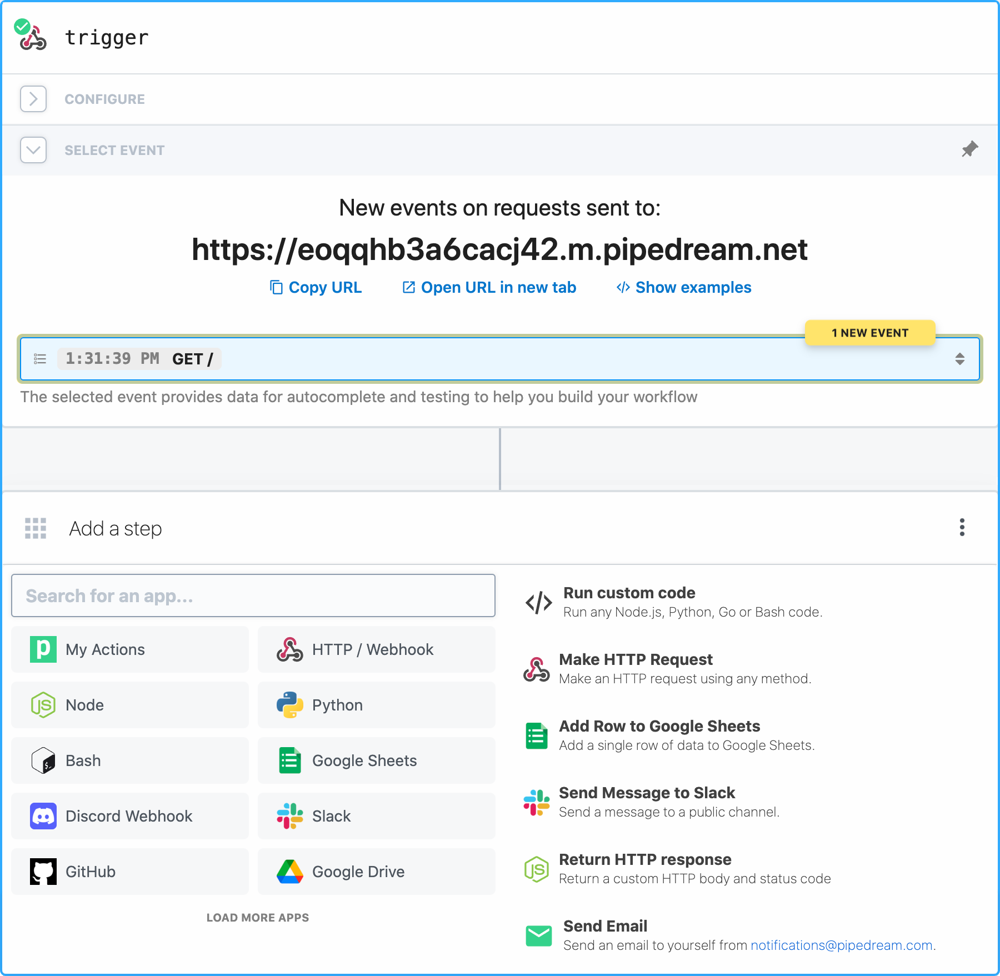
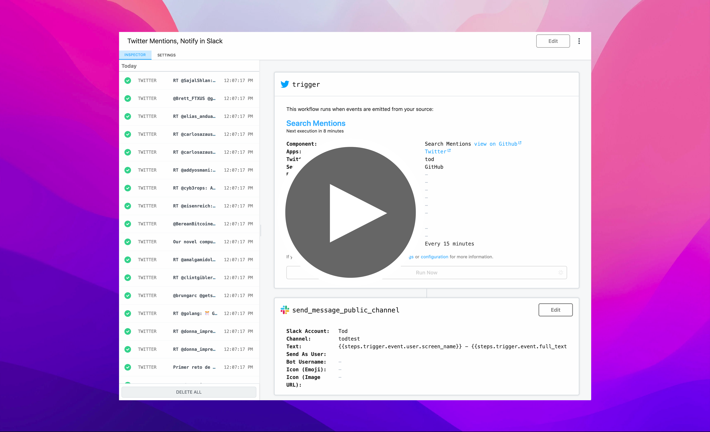

<p align="center">
  <a href="https://khulnasoft.com/community"></a>
  <a href="https://khulnasoft.com/support"></a>
  <a href="https://twitter.com/intent/follow?original_referer=https%3A%2F%2Fpublish.twitter.com%2F%3FbuttonType%3DFollowButton%26query%3Dhttps%253A%252F%252Ftwitter.com%252Fnexusstream%26widget%3DButton&ref_src=twsrc%5Etfw&region=follow_link&screen_name=nexusstream&tw_p=followbutton"></a>
  <a href="https://wellfound.com/company/khulnasoft/jobs"></a>
</p>

Nexusstream is an integration platform for developers.

Nexusstream provides a free, hosted platform for connecting apps and developing event-driven automations. The platform has over 1,000 fully-integrated applications, so you can use pre-built components to quickly send messages to Slack, add a new row to Google Sheets, and more. You can also run any Node.js, Python, Golang, or Bash code when you need custom logic. Nexusstream has demonstrated SOC 2 compliance and can provide a SOC 2 Type 2 report upon request (please email support@khulnasoft.com).

<p align="center">
  <br />
  
  <br />
</p>

This repo contains:

- [The code for all pre-built integration components](https://github.com/KhulnaSoft/nexusstream/tree/master/components)
- [The product roadmap](https://github.com/KhulnaSoft/nexusstream/issues)
- [The Nexusstream docs](https://github.com/KhulnaSoft/nexusstream/tree/master/docs)
- And other source code related to Nexusstream.

This `README` explains the key features of the platform and how to get started.

To get support, please visit [https://khulnasoft.com/support](https://khulnasoft.com/support).

## Key Features

- [Workflows](#workflows) - Workflows run automations. Workflows are sequences of steps - pre-built actions or custom [Node.js](https://khulnasoft.com/docs/code/nodejs/), [Python](https://khulnasoft.com/docs/code/python/), [Golang](https://khulnasoft.com/docs/code/go/), or [Bash](https://khulnasoft.com/docs/code/bash/) code - triggered by an event (HTTP request, timer, when a new row is added to a Google Sheets, and more).
- [Event Sources](#event-sources) - Sources trigger workflows. They emit events from services like GitHub, Slack, Airtable, RSS and [more](https://khulnasoft.com/apps). When you want to run a workflow when an event happens in any third-party app, you're using an event source.
- [Actions](#actions) - Actions are pre-built code steps that you can use in a workflow to perform common operations across Nexusstream's 1,000+ API integrations. For example, you can use actions to send email, add a row to a Google Sheet, [and more](https://khulnasoft.com/apps).
- [Custom code](#code) - Most integrations require custom logic. Code is often the best way to express that logic, so Nexusstream allows you to run any [Node.js](https://khulnasoft.com/docs/code/nodejs/), [Python](https://khulnasoft.com/docs/code/python/), [Golang](https://khulnasoft.com/docs/code/go/), or [Bash](https://khulnasoft.com/docs/code/bash/) code. You can import any package from the languages' package managers, connect to any Nexusstream connected app, and more. Nexusstream is "low-code" in the best way: you can use pre-built components when you're performing common actions, but you can write custom code when you need to.
- [Destinations](#destinations) - Deliver events asynchronously to common destinations like Amazon S3, Snowflake, HTTP and email.
- [Free](#pricing) - No fees for individual developers (see [limits](https://docs.khulnasoft.com/limits/))

## Demo

Click the image below to watch a brief demo on YouTube.

<p align="center">
  <br />
  <a href="https://bit.ly/36fwHWs">
    
  </a>
</p>

### Workflows

Workflows are sequences of linear [steps](https://khulnasoft.com/docs/workflows/steps) triggered by an event (like an HTTP request, or when a new row is added to a Google sheet). You can quickly develop complex automations using workflows and connect to any of our 1,000+ integrated apps.

[See our workflow quickstart](https://khulnasoft.com/docs/quickstart/) to get started.

### Event Sources

[Event Sources](https://khulnasoft.com/docs/sources/) watch for new data from services like GitHub, Slack, Airtable, RSS and [more](https://khulnasoft.com/apps). When a source finds a new event, it emits it, triggering any linked workflows.

You can also consume events emitted by sources using [Nexusstream's REST API](https://khulnasoft.com/docs/api/rest/) or a private, real-time [SSE stream](https://khulnasoft.com/docs/api/sse/).

When a pre-built source doesn't exist for your use case, [you can build your own](https://khulnasoft.com/docs/components/quickstart/nodejs/sources/). Here is the simplest event source: it exposes an HTTP endpoint you can send any request to, and prints the contents of the request when invoked:

```javascript
export default {
  name: "http",
  version: "0.0.1",
  props: {
    http: "$.interface.http",
  },
  run(event) {
    console.log(event); // event contains the method, payload, etc.
  },
};
```

<a href="https://khulnasoft.com/sources/new?app=http"></a>

You can find the code for all pre-built sources in [the `components` directory](https://github.com/KhulnaSoft/nexusstream/tree/master/components). If you find a bug or want to contribute a feature, [see our contribution guide](https://khulnasoft.com/docs/components/guidelines/#process).

### Actions

[Actions](https://khulnasoft.com/docs/components/actions/) are pre-built code steps that you can use in a workflow to perform common operations across Nexusstream's 500+ API integrations. For example, you can use actions to send email, add a row to a Google Sheet, [and more](https://khulnasoft.com/apps).

You can [create your own actions](https://khulnasoft.com/docs/components/quickstart/nodejs/actions/), which you can re-use across workflows. You can also [publish actions to the entire Nexusstream community](https://khulnasoft.com/docs/components/guidelines/), making them available for anyone to use.

Here's an action that accepts a `name` as input and prints it to the workflow's logs:

```javascript
export default {
  name: "Action Demo",
  description: "This is a demo action",
  key: "action_demo",
  version: "0.0.1",
  type: "action",
  props: {
    name: {
      type: "string",
      label: "Name",
    },
  },
  async run() {
    return `hello ${this.name}!`;
  },
};
```

You can find the code for all pre-built actions in [the `components` directory](https://github.com/KhulnaSoft/nexusstream/tree/master/components). If you find a bug or want to contribute a feature, [see our contribution guide](https://khulnasoft.com/docs/components/guidelines/#process).

### Custom code

Most integrations require custom logic. Code is often the best way to express that logic, so Nexusstream allows you to run custom code in a workflow using:

<table align="center">
  <tr>
    <td>
      <a href="https://khulnasoft.com/docs/code/nodejs/">
        
      </a>
    </td>
    <td>
      <a href="https://khulnasoft.com/docs/code/python/">
        
      </a>
    </td>
  </tr>
  </tr>
    <td>
      <a href="https://khulnasoft.com/docs/code/go/">
        
      </a>
    </td>
    <td>
      <a href="https://khulnasoft.com/docs/code/bash/">
        
      </a>
    </td>
  </tr>
</table>

You can import any package from the languages' package managers by declaring the imports directly in code. Nexusstream will parse and download the necessary dependencies.

```javascript
// Node.js
import axios from "axios";
```

```python
# Python
import pandas as pd
```

```golang
// Go
import (
    "fmt"
    pd "github.com/KhulnaSoft/nexusstream-go"
)
```

You can also [connect to any Nexusstream connected app in custom code steps](https://khulnasoft.com/docs/code/nodejs/auth/). For example, you can connect your Slack account and send a message to a channel:

```javascript
import { WebClient } from "@slack/web-api";

export default defineComponent({
  props: {
    // This creates a connection called "slack" that connects a Slack account.
    slack: {
      type: "app",
      app: "slack",
    },
  },
  async run({ steps, $ }) {
    const web = new WebClient(this.slack.$auth.oauth_access_token);

    return await web.chat.postMessage({
      text: "Hello, world!",
      channel: "#general",
    });
  },
});
```

### Destinations

[Destinations](https://khulnasoft.com/docs/destinations/), like actions, abstract the connection, batching, and delivery logic required to send events to services like Amazon S3, or targets like HTTP and email.

For example, sending data to an Amazon S3 bucket is as simple as calling `$send.s3()`:

```javascript
$send.s3({
  bucket: "your-bucket-here",
  prefix: "your-prefix/",
  payload: event.body,
});
```

Nexusstream supports the following destinations:

- [Amazon S3](https://docs.khulnasoft.com/destinations/s3/)
- [Snowflake](https://docs.khulnasoft.com/destinations/snowflake/)
- [HTTP](https://docs.khulnasoft.com/destinations/http/)
- [Email](https://docs.khulnasoft.com/destinations/email/)
- [SSE](https://docs.khulnasoft.com/destinations/sse/)

## Contributors

Thank you to everyone who has contributed to the Nexusstream codebase. We appreciate you!

<a href="https://github.com/KhulnaSoft/nexusstream/graphs/contributors">
  
</a>

## Pricing

Nexusstream has a [generous free tier](https://khulnasoft.com/docs/pricing/#developer-tier). You can run sources and workflows for free within the limits of the free tier. If you hit these limits, you can upgrade to one of our [paid tiers](https://khulnasoft.com/docs/pricing/).

## Limits

The Nexusstream platform imposes some runtime limits on sources and workflows. [Read more about those in our docs](https://khulnasoft.com/docs/limits/).

## Found a Bug? Have a Feature to suggest?

Before adding an issue, please search the [existing issues](https://github.com/KhulnaSoft/nexusstream/issues) or [reach out to our team](https://khulnasoft.com/support/) to see if a similar request already exists.

If an issue exists, please [add a reaction](https://help.github.com/en/github/collaborating-with-issues-and-pull-requests/about-conversations-on-github) or add a comment detailing your specific use case.

If an issue _doesn't_ yet exist and you need to create one, please [use the issue templates](https://github.com/KhulnaSoft/nexusstream/issues/new/choose).

## Security

You can read about our platform security and privacy [here](https://khulnasoft.com/docs/privacy-and-security/).

If you'd like to report a suspected vulnerability or security issue, or have any questions about the security of the product, please contact our security team at **security@khulnasoft.com**.
